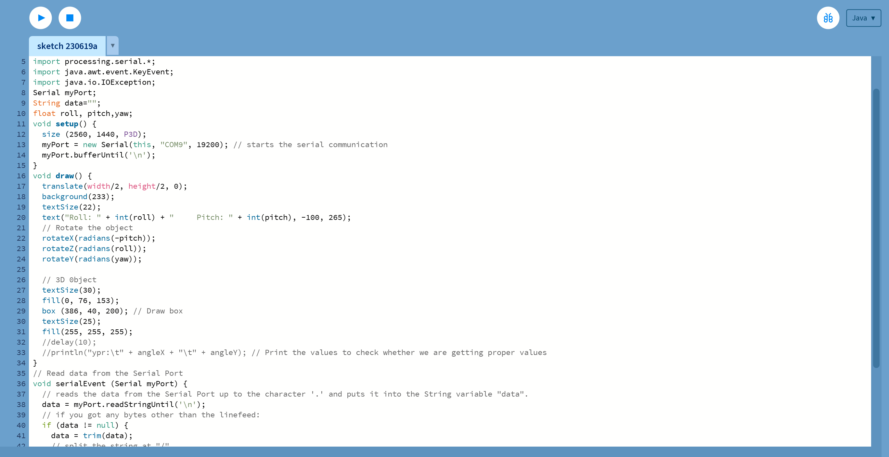
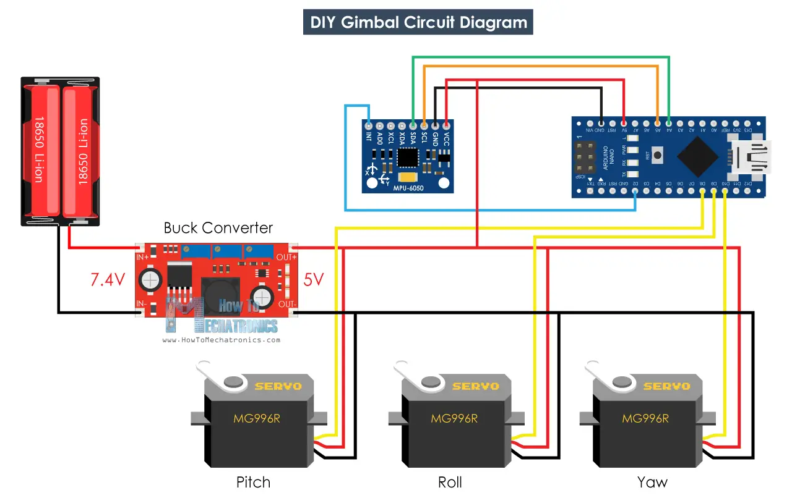

# Camera Gimbal
This project details the system of a 3D printed camera gimbal that stabilizes a user's video footage using MPU sensors, servoes and an Arduino board. The project was built with improvisation on parts such as nuts and bolts, as well as a power source, to complete and finalize building. In addition to the base project, mods were included to further enhance the performance and compatibility of the whole device. The process of building this entire system provided knowledge on coding and basic engineering such as soldering and wiring from a source such as USB, as well as CAD experience from a web based 3D modeling program called Onshape. I'm most interested in this project because it introduces the concept of real time responses and its contribution to the advancements of media recording in applications such as movies, TV shows, and other kinds of media filming.

| **Engineer** | **School** | **Area of Interest** | **Grade** |
|:--:|:--:|:--:|:--:|
| Jeremy H | Saratoga High School | Electrical, Firmware and Mechanical Engineering | Incoming Sophmore

<!--**Replace the BlueStamp logo below with an image of yourself and your completed project. Follow the guide [here](https://tomcam.github.io/least-github-pages/adding-images-github-pages-site.html) if you need help.**
-->


# Fourth Milestone: Mods

<iframe width="560" height="315" src="https://www.youtube.com/embed/mpugOpy33oE" title="YouTube video player" frameborder="0" allow="accelerometer; autoplay; clipboard-write; encrypted-media; gyroscope; picture-in-picture; web-share" allowfullscreen></iframe>

For my fourth and final milestone, I designed my own mods that provided a more efficient use of my device, the camera gimbal. The device's baseplate is only compatible with mounts for camera that are not from mobile phones, so my first plan was to design a phone holder that fit onto the baseplate and held a phone for me to use with my device. In addition, I realized that, while using the device, I didn't get a good enough hold of the gimbal because of the bulkiness of the handle, so I added some foam strips to help with the grip and ergonomics of the handle. The battery that came included with my project didn't fit in the handle, where the other componenets and wiring was, so I implemented a mod that had a crevice that holds the battery pack on the bottom of the device cover with a piece of velcro and some hot glue, which provides enough grip so that the battery pack doesn't slide or wiggle around when recording. The biggest challenge I encountered was the amount of trial and error I had to go through to CAD parts of the phone holder and battery holder, since I started from scratch. I went through many different prototypes of the mods to find a model that was not only effective but strong enough to last many uses. The phone holder itself took many stepping stones to achieve a final result, such as testing the mechanism that holds the phone, the peg inserts that attach to the baseplate, the holes that allow for screws to fasten into the mod, as well as many others. The biggest takeaway I gained from this project was the experience that was unlocked when building my CAD mods, in addition to a solid, but not perfect, understanding of C++ code in Arduino form. 

# Third Milestone

<iframe width="560" height="315" src="https://www.youtube.com/embed/n_57BFN_kvQ" title="YouTube video player" frameborder="0" allow="accelerometer; autoplay; clipboard-write; encrypted-media; gyroscope; picture-in-picture; web-share" allowfullscreen></iframe>

For my third milestone, I organized all the wiring in my device and put them into the device itself to create space and give the device a mobile form factor. The biggest challenge I had to troubleshoot during this milestone progression was that my current wiring was poor, which caused my servos to not function properly. I resoldered all of my wires and cut new ones, which established a firm and stable connection between the device's power, Arduino, sensor, and servos. On top of my device functioning properly, I discovered that the Arduino and MPU6050 accelerometer's GND pin must be connected to a power source to function with the 5V connection. The information prompted me to introduce a new connection between the Arduino and accelerometer's GND pin to a power bank, which was a big achievement as it reduced the amount of power sources required from two to one. In the past, incorrect wiring forced me to use two sources of power, a power bank for the servos and a 9V battery for the Arduino and sensor. However, this change in my project made the device more effective by making its wiring less messy by taking away from the bundle of wires that I placed into the device, which decreases the chances of short circuits to occur by wires coming into contact. The power bank I used was too large to fit inside the device handle itself, so I moved the cable connection to the power bank outside the device, giving me a new opportunity to create a part that can benefit the ergonomics of the gimbal handle. At Bluestamp Engineering, this project I had chosen introduced an overwhelming amount of challenges for me to fix, which made me learn a lot about many different paths of engineering, such as coding and firmware. However, I intend to use the rest of my time attending Bluestamp to innovate by myself and create a CAD part for my camera gimbal that introduces campatability for phone recordings, in addition to a part that can turn my power bank into more ergonomic handle for holding the device, essentially killing two birds with one stone by giving the power bank a place to be a part of the device as well as including a more effective usage of the device.

# Second Milestone

<iframe width="560" height="315" src="https://www.youtube.com/embed/FN5Kb476y0Y" title="YouTube video player" frameborder="0" allow="accelerometer; autoplay; clipboard-write; encrypted-media; gyroscope; picture-in-picture; web-share" allowfullscreen></iframe>

For my second milestone, I achieved the basic completion of my project and the successful functions of the components as a whole. I uploaded specific code to my Arduino board, which powers the MPU6050 accelerometer, which controls the gyro values of the device. I have an external source of electricity, a power bank, which powers the servos to coordinate with the accelerometer to stabilize movement on the gimbal. The biggest issue with the completion of the device was a consistent amount of errors with the servos while testing, as the servos started to move unnecessarily, which I am troubleshooting with the hopes of pinpointing and fixing in the near future. Currently, I assume that the problem has to do with the placement of the wiring that binds the components together, which is inconsistent in length and can tug along the servo's wires, creating errors.

# First Milestone

<iframe width="560" height="315" src="https://www.youtube.com/embed/_8qPUXlMU-E" title="YouTube video player" frameborder="0" allow="accelerometer; autoplay; clipboard-write; encrypted-media; gyroscope; picture-in-picture; web-share" allowfullscreen></iframe>

For my first milestone, I achieved two key points to my project: To successfully acquire my MPU6050 accelerometer readings and then visualize their readings in real time with a coding software called processing. Something I definitely did not expect was the amount of troubleshooting that I had to complete in order to achieve my milestone, as the code being used had many errors that affected the readings of the component. The code I implemented included error values to counter drift that the accelerometer would pick up over time, which were wrong. I had to find the exact error values of the X, Y and Z readings to get accurate readings through guessing and checking. 

This is the code that visualizes the readings of the MPU onto Processing:

The code takes the code from the Arduino board and creates a model of the breadboard the accelerometer and Arduino is pinned into and changes it in real time according to the readings of the accelerometer.

# Starter Project

<iframe width="560" height="315" src="https://www.youtube.com/embed/s5TrzVyCpa0" title="YouTube video player" frameborder="0" allow="accelerometer; autoplay; clipboard-write; encrypted-media; gyroscope; picture-in-picture; web-share" allowfullscreen></iframe>

For my starter project, I built a board featuring the classic game of Simon Says. I chose this project because I took interest in its hands on construction that results in a fun game that challenges memory, listening and visual skills for players of all ages. This project includes working with a basic components such as a microcontroller, resistor and capacitor. In addition, the board required basic soldering to complete and function, which was the biggest obstacle I faced while working on this Simon Says board, as I started the project without prior knowledge on how to solder components such as LEDs together. However, I completed the project on my first day here as a great stepping stone, in terms of experience, to what I am going to accomplish next during my time at Bluestamp, which is the Camera Gimbal project.

# Schematics 

By Dejan from HowToMechatronics


# CAD Files

Below are the included and new models that I used to print my device and mods.


# Code

```
/*
  DIY Gimbal - MPU6050 Arduino Tutorial
  by Dejan, www.HowToMechatronics.com
  Code based on the MPU6050_DMP6 example from the i2cdevlib library by Jeff Rowberg:
  https://github.com/jrowberg/i2cdevlib
*/
// I2Cdev and MPU6050 must be installed as libraries, or else the .cpp/.h files
// for both classes must be in the include path of your project
#include "I2Cdev.h"

#include "MPU6050_6Axis_MotionApps20.h"
//#include "MPU6050.h" // not necessary if using MotionApps include file

// Arduino Wire library is required if I2Cdev I2CDEV_ARDUINO_WIRE implementation
// is used in I2Cdev.h
#if I2CDEV_IMPLEMENTATION == I2CDEV_ARDUINO_WIRE
#include "Wire.h"
#endif
#include <Servo.h>
// class default I2C address is 0x68
// specific I2C addresses may be passed as a parameter here
// AD0 low = 0x68 (default for SparkFun breakout and InvenSense evaluation board)
// AD0 high = 0x69
MPU6050 mpu;
//MPU6050 mpu(0x69); // <-- use for AD0 high

// Define the 3 servo motors
Servo servo0;
Servo servo1;
Servo servo2;
float correct;
int j = 0;

#define OUTPUT_READABLE_YAWPITCHROLL

#define INTERRUPT_PIN 2  // use pin 2 on Arduino Uno & most boards

bool blinkState = false;

// MPU control/status vars
bool dmpReady = false;  // set true if DMP init was successful
uint8_t mpuIntStatus;   // holds actual interrupt status byte from MPU
uint8_t devStatus;      // return status after each device operation (0 = success, !0 = error)
uint16_t packetSize;    // expected DMP packet size (default is 42 bytes)
uint16_t fifoCount;     // count of all bytes currently in FIFO
uint8_t fifoBuffer[64]; // FIFO storage buffer

// orientation/motion vars
Quaternion q;           // [w, x, y, z]         quaternion container
VectorInt16 aa;         // [x, y, z]            accel sensor measurements
VectorInt16 aaReal;     // [x, y, z]            gravity-free accel sensor measurements
VectorInt16 aaWorld;    // [x, y, z]            world-frame accel sensor measurements
VectorFloat gravity;    // [x, y, z]            gravity vector
float euler[3];         // [psi, theta, phi]    Euler angle container
float ypr[3];           // [yaw, pitch, roll]   yaw/pitch/roll container and gravity vector

// packet structure for InvenSense teapot demo
uint8_t teapotPacket[14] = { '$', 0x02, 0, 0, 0, 0, 0, 0, 0, 0, 0x00, 0x00, '\r', '\n' };


// ================================================================
// ===               INTERRUPT DETECTION ROUTINE                ===
// ================================================================

volatile bool mpuInterrupt = false;     // indicates whether MPU interrupt pin has gone high
void dmpDataReady() {
  mpuInterrupt = true;
}

// ================================================================
// ===                      INITIAL SETUP                       ===
// ================================================================

void setup() {
  // join I2C bus (I2Cdev library doesn't do this automatically)
#if I2CDEV_IMPLEMENTATION == I2CDEV_ARDUINO_WIRE
  Wire.begin();
  Wire.setClock(400000); // 400kHz I2C clock. Comment this line if having compilation difficulties
#elif I2CDEV_IMPLEMENTATION == I2CDEV_BUILTIN_FASTWIRE
  Fastwire::setup(400, true);
#endif

  // initialize serial communication
  // (115200 chosen because it is required for Teapot Demo output, but it's
  // really up to you depending on your project)
  Serial.begin(38400);
  while (!Serial); // wait for Leonardo enumeration, others continue immediately

  // initialize device
  //Serial.println(F("Initializing I2C devices..."));
  mpu.initialize();
  pinMode(INTERRUPT_PIN, INPUT);
  devStatus = mpu.dmpInitialize();
  // supply your own gyro offsets here, scaled for min sensitivity
  mpu.setXGyroOffset(17);
  mpu.setYGyroOffset(-69);
  mpu.setZGyroOffset(27);
  mpu.setZAccelOffset(1551); // 1688 factory default for my test chip

  // make sure it worked (returns 0 if so)
  if (devStatus == 0) {
    // turn on the DMP, now that it's ready
    // Serial.println(F("Enabling DMP..."));
    mpu.setDMPEnabled(true);

    attachInterrupt(digitalPinToInterrupt(INTERRUPT_PIN), dmpDataReady, RISING);
    mpuIntStatus = mpu.getIntStatus();

    // set our DMP Ready flag so the main loop() function knows it's okay to use it
    //Serial.println(F("DMP ready! Waiting for first interrupt..."));
    dmpReady = true;

    // get expected DMP packet size for later comparison
    packetSize = mpu.dmpGetFIFOPacketSize();
  } else {
    // ERROR!
    // 1 = initial memory load failed
    // 2 = DMP configuration updates failed
    // (if it's going to break, usually the code will be 1)
    // Serial.print(F("DMP Initialization failed (code "));
    //Serial.print(devStatus);
    //Serial.println(F(")"));
  }

  // Define the pins to which the 3 servo motors are connected
  servo0.attach(10);
  servo1.attach(9);
  servo2.attach(8);
}
// ================================================================
// ===                    MAIN PROGRAM LOOP                     ===
// ================================================================

void loop() {
  // if programming failed, don't try to do anything
  if (!dmpReady) return;

  // wait for MPU interrupt or extra packet(s) available
  while (!mpuInterrupt && fifoCount < packetSize) {
    if (mpuInterrupt && fifoCount < packetSize) {
      // try to get out of the infinite loop
      fifoCount = mpu.getFIFOCount();
    }
  }

  // reset interrupt flag and get INT_STATUS byte
  mpuInterrupt = false;
  mpuIntStatus = mpu.getIntStatus();

  // get current FIFO count
  fifoCount = mpu.getFIFOCount();

  // check for overflow (this should never happen unless our code is too inefficient)
  if ((mpuIntStatus & _BV(MPU6050_INTERRUPT_FIFO_OFLOW_BIT)) || fifoCount >= 1024) {
    // reset so we can continue cleanly
    mpu.resetFIFO();
    fifoCount = mpu.getFIFOCount();
    Serial.println(F("FIFO overflow!"));

    // otherwise, check for DMP data ready interrupt (this should happen frequently)
  } else if (mpuIntStatus & _BV(MPU6050_INTERRUPT_DMP_INT_BIT)) {
    // wait for correct available data length, should be a VERY short wait
    while (fifoCount < packetSize) fifoCount = mpu.getFIFOCount();

    // read a packet from FIFO
    mpu.getFIFOBytes(fifoBuffer, packetSize);

    // track FIFO count here in case there is > 1 packet available
    // (this lets us immediately read more without waiting for an interrupt)
    fifoCount -= packetSize;

    // Get Yaw, Pitch and Roll values
#ifdef OUTPUT_READABLE_YAWPITCHROLL
    mpu.dmpGetQuaternion(&q, fifoBuffer);
    mpu.dmpGetGravity(&gravity, &q);
    mpu.dmpGetYawPitchRoll(ypr, &q, &gravity);

    // Yaw, Pitch, Roll values - Radians to degrees
    ypr[0] = ypr[0] * 180 / M_PI;
    ypr[1] = ypr[1] * 180 / M_PI;
    ypr[2] = ypr[2] * 180 / M_PI;
    
    // Skip 300 readings (self-calibration process)
    if (j <= 300) {
      correct = ypr[0]; // Yaw starts at random value, so we capture last value after 300 readings
      j++;
    }
    // After 300 readings
    else {
      ypr[0] = ypr[0] - correct; // Set the Yaw to 0 deg - subtract  the last random Yaw value from the currrent value to make the Yaw 0 degrees
      // Map the values of the MPU6050 sensor from -90 to 90 to values suatable for the servo control from 0 to 180
      int servo0Value = map(ypr[0], -90, 90, 0, 180);
      int servo1Value = map(ypr[1], -90, 90, 0, 180);
      int servo2Value = map(ypr[2], -90, 90, 180, 0);
      
      // Control the servos according to the MPU6050 orientation
      servo0.write(servo0Value);
      servo1.write(servo1Value);
      servo2.write(servo2Value);
    }
#endif
  }
}
```

# Bill of Materials

| **Part** | **Purpose** | **Price** | **Link** |
|:--:|:--:|:--:|:--:|
| MPU 6050 IMU | Accelerometer for Gyro Detection and Stabilization | $9.99 | <a href="https://www.amazon.com/HiLetgo-MPU-6050-Accelerometer-Gyroscope-Converter/dp/B00LP25V1A?crid=EPJ36BB9OJLO&keywords=MPU-6050&qid=1664878452&qu=eyJxc2MiOiIyLjkwIiwicXNhIjoiMi45NSIsInFzcCI6IjIuOTcifQ%3D%3D&sprefix=mpu6050,aps,266&sr=8-3&linkCode=sl1&tag=howto045-20&linkId=a10e35b9e08344c4716bc03a15f70908&language=en_US&ref_=as_li_ss_tl"> Link </a> |
|||||
| MG996R Servo | Device Arm Movement | $15.99 | <a href="https://www.amazon.com/YoungRC-MG996R-Torque-Digital-Helicopter/dp/B07PBJ1L8F?crid=U460WD9J18O5&keywords=MG996R&qid=1668338350&sprefix=mg996r,aps,470&sr=8-10&linkCode=sl1&tag=howto045-20&linkId=da31e960c0d15fb4970dcb1c3c0542ac&language=en_US&ref_=as_li_ss_tl"> Link </a> |
|||||
| Arduino Nano Board | Holds All Code and Function | $26.00 | <a href="https://www.amazon.com/Arduino-A000005-ARDUINO-Nano/dp/B0097AU5OU/ref=as_li_ss_tl?keywords=arduino+nano&qid=1554818901&s=electronics&sr=1-4&linkCode=sl1&tag=creativity02-20&linkId=b9db1fe83cb2f834ad5f8d01ece300cd&language=en_US"> Link </a> |
|||||
| Anker Power Bank | Provides Power to Device | $17.99 | <a href="https://www.amazon.com/Anker-PowerCore-Ultra-Compact-High-Speed-Technology/dp/B01CU1EC6Y/ref=sr_1_11?crid=2NBYWOCLV5SOO&keywords=anker+power+bank+5+volt&qid=1687464871&sprefix=anker+power+bank+5+vo%2Caps%2C169&sr=8-11"> Link </a> |

<!-- # Other Resources/Examples 
-->

